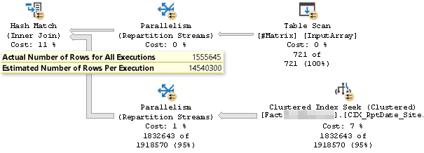

# MSSQL Better SQL
An article is about how to control the plan optimizer to take better, more performant paths

You should have knowledge about [operators](https://tcd93.github.io/MSSQL-execution-plan/) first

---
# Table of contents
- [Avoid Order](#avoid-order)
- [Avoid Spool / Big Loop](#avoid-spool--big-loop)
- [Filtering: Inner Join vs. Exists](#inner-join-vs.-exists-for-filtering)
- [Summary](#summary)

---

# Avoid Order

## Scenario
We have an slow SQL with the following format
```sql
SELECT … FROM #X 
    LEFT JOIN #Y ON … 
    LEFT JOIN #Z ON … 
    GROUP BY X.A, Y.B, Z.C

UNION ALL

SELECT … FROM #X 
    LEFT JOIN #Y ON … 
    GROUP BY X.A, Y.B

ORDER BY X.A, Y.B, Z.C
```

Here is the execution plan:


The optimizer opted for the Merge Join execution plan as it sees it is the better option than Nested Loop or Hash Join.

Since the inner query is rather complicated, indexes can not be used, thus a sort operation has to be added in order for Merge join to work.

Note that in the above example, the sort operation was actually for stream aggregate (Group By) function, the Merge Join reused the results, but still, a sort is needed nevertheless.

We have two ways to make this better:
1. Remove `order`
2. Rewrite the query

### Remove Order
This is the plan after remove the `ORDER BY`:


It opted for the Hash Match (Aggregate) in the bottom path instead of Sort + Stream Aggregate which removed the high I/O cost from the sort operation (the more rows it has, the more I/O it needs); Merge Join is also replaced with Concatenation.

In return, hash functions require more CPU power, but this trade-off is acceptable & more balanced:


#### When can we remove it?
`Order By` is a very costly operation if there is no index available to cover it.

If there is no need to display data set in an ordered fashion (ex: ad-hoc query), we should remove it.

If we're providing paginated result to display on web application, we should remove it, let application code handle the much smaller dataset's ordering.

Also there’s always a probability that a developer used “order by” to debug / test their data and forgot to remove it afterwards 😁

#### What if we can't?
Consider these options:
- Use a covering index
- Optimize inner queries (between Unions)

#### Use Index
Strem aggregate & merge join operators are one of the most effective physical operators in MSSQL _if the inputs are already sorted_.

We can exploit this fact by combining them with an index.

For a simple query such as:
```sql
SELECT A, SUM(Metrics) FROM #X GROUP BY A
```

A clustered index on column A would be enough to speed up this query because the optimizer can use Stream Aggregate on the already ordered index data as inputs.

But a more complicated one like this:
```sql
SELECT X.A, Y.B, SUM(Metrics) 
FROM #X 
JOIN #Y ON …  
GROUP BY X.A, Y.B
SORT BY X.A, Y.B
```
No indexes can be used, as the sorting needs to be done on the joined result from #X and #Y. Optimizing this type of SQL using the “traditional” method is very hard (if not impossible)

Let’s go back to the [original query](#scenario)


Notice these branches use the same anchor table #X, but in the original plan the executor just run sort operation on every branch, so there were many wasted effort sorting the same (or almost the same) data set.

What we can do is to extract the data set that “encompass” all others in the unions out to a temporary table (simply put - the query that produce the most rows):

```sql
SELECT X.A, Y.B, Measures…
INTO #mergedTmp
FROM X LEFT JOIN Y ON … 
	LEFT JOIN Z ON … 

CREATE CLUSTERED INDEX I1 ON #mergedTmp (A, B)
```

And then rewrite the original SQL using the #mergedTmp and see result:


There is no more sorting before aggregation, and compare with the original plan, the cost is almost 4 times lower.


Of course this is just comparing the two individual SQLs, this method is going to require some overhead to actually populate the temporary data, but the more UNIONS of the same type you have, the more efficient this is going to be.

In the above example, we can spot the “anchor” data, but if we got really unlucky and there’s no correlation whatsoever between each union block, then we’d just have to optimize the individual blocks separately.

# Avoid Spool / Big Loop

## Scenario
We have an SQL that retrieves the last 4 transactions associated with a customer, the following takes more than 7 seconds to run on my machine:
```sql
SELECT transdate, username, amount
FROM customer c 
CROSS APPLY (
	SELECT TOP 4 transdate, winlost
	FROM trans t
	WHERE t.custid = c.custid AND t.custid = 1340408
	ORDER BY transdate DESC
) AS T
```


At first glance we notice the Sort operator taking 95% of the total cost (again, the Sort). So we’d create an index on transdate column and problem solved?

Not so fast, if we're gonna create a new index each time we encounter a slow SQL then our database will be flooded. Let's check the existing ones first:
- There is already an index of column CustID on the transaction table called IX_CustId
- There is also an index of CustID on Customer table

So something is not right, the optimizer is not using them despite the query is joining on that column.

### What's wrong?
There is a big fat arrow from the index scan to the index spool, meaning it is storing millions of rows of transaction data into a temporary index, which is overkill for just 1 customer


There is a problem with CROSS APPLY, the optimizer do not “see into” each block, it just optimize each of them separately.

To fix this, specifically tell the optimizer we need just one customer here:
```diff
SELECT transdate, username, amount
- FROM customer c
+ FROM (SELECT custid, username FROM customer WHERE custid = 1340408) c
CROSS APPLY (
	SELECT TOP 4 transdate, winlost
	FROM trans t
-   WHERE t.custid = c.custid AND t.custid = 1340408
+   WHERE t.custid = c.custid
	ORDER BY transdate DESC
 ) AS T
```

This time the index is properly used, and took 0 second, we can ignore the Key lookup for now, the plan is “good enough”


What if we need multiple customers instead of one? It became slow again (7 seconds)
```sql
SELECT transdate, username, amount
FROM (
    SELECT custid, username FROM customer WHERE custid BETWEEN 1340408 AND 2000000
) c
CROSS APPLY (
	SELECT TOP 4 transdate, winlost
	FROM trans t
    WHERE t.custid = c.custid
	ORDER BY transdate DESC
) AS T
```

The Spool also goes back, this query returns 422 rows which is just about 100 customers


Let’s check how many _actual_ customer is from ID 1340000 - 2000000: 
```sql
SELECT COUNT(1) FROM customer WHERE custid BETWEEN 1340408 AND 2000000
```

This returns about 10,000 rows, so the density is very low (100 / 10000 = 0.001). Meaning: _there are many registered customers, but very few of them actually made transactions._

The query optimizer does not know how many customers are IN the transaction table with the ID from 1340000 to 2000000, so it opted for a “safe” way that is to scan the entire transaction table, where in fact there is just 0.001 hit rate per scan

Again, add another condition to pre-filter data before passing them into inner loop:
```diff
SELECT transdate, username, amount
FROM (
    SELECT custid, username FROM customer WHERE custid BETWEEN 1340408 AND 2000000
+      AND EXISTS (SELECT 1 FROM trans t WHERE t.custid = customer.custid) 
 ) c
CROSS APPLY (
	SELECT TOP 4 transdate, winlost
	FROM trans t
    WHERE t.custid = c.custid
	ORDER BY transdate DESC
 ) AS T
```

The data is filtered before passing into the inner loop using a Merge join, so the amount of loops it has to do is very low, thus near-instant execution time again:


### Re-writing the query
There’s a more generic way to achieve this result without using CROSS APPLY, that is by window function `ROW_NUMBER`

```sql
SELECT transdate, username, winlost
FROM (
	SELECT transdate, c.username, winlost,
		row_number() over (partition by c.custid order by t.transdate desc) rn
	FROM customer c
	INNER JOIN trans t
		ON c.custid = t.custid
	WHERE c.custid between 1340000 and 2000000
) AS s
WHERE rn <= 4
```


Very straightforward, data arrows do not get trimmed down until it reached the last filter operation. This query is executed instantly, but at a much higher CPU cost than the previous one due to the Sort:


### Why avoid Spool?
Spools (table spool / index spool) are a way for the optimizer to improve your SQL. But, it comes with a high cost (storing data in tempdb). Also, when data density is low, then lazy-loading practically becomes useless and just hinder the performance even more.

Technically they are not bad per-se, but it certainly does imply a better execution plan can possibly be achieved without them (except for special queries such as Recursive CTE, HierarchyID…)

### Why avoid Big Loop?
Nested Loop Join is the most efficient physical join operator when the outer input is small compared to the (indexed) inner input (low CPU & IO cost, even sometimes better than Merge Join)

But since it has a Big-O of O(n<sup>2</sup>) or O(n.log(m)), the performance degrade is terrible when we select more data from the outer loop. That’s why it is very good in OLTP systems, but not so much compared to Hash / Merge joins in OLAP systems.

# Inner Join vs. Exists for filtering
Let's say we do some __filtering__ on a very big table:
```sql
SELECT ...
FROM BigFact
INNER JOIN #InputArray
```


The estimated number is way off actual despite updated stats.

This is because Optimizer does not know about the relationship between the BigTable and the #InputArray, so it goes for a generic Hash join, which is good enough but uses a lot of memory.

Adding an index achieve better statistics, but the memory grant is still greater than what is actually needed:


Now rewrite the query using `EXISTS`:
```sql
SELECT ...
FROM BigFact
WHERE EXISTS (SELECT 1 FROM #InputArray WHERE ...)
```


We specifically tell the Optimizer the relationship between the BigTable and #InputArray is at most many-to-one by using EXISTS clause.

Plan now uses right semi join which preserve all rows of BigTable, the estimated number can now only be lower than the actual rows of BigTable.

# Summary
* Don’t jump straight into the warning signs and try to optimize individual operators; don’t try to reduce  the cost of an operator, examine why it has high cost in the first place
* Understand how the optimizer works (it’s not as smart as you think, provide it with more information), high cost doesn’t mean it’s bad, maybe it’s just inevitable
* Look at the big picture, go from bigger to smaller; look at the size of arrows, watch out for the big ones, some operators don’t work well with big arrows
* Check for spools / sort operators, try to rewrite the query without them
* Update statistics frequently
* To filter data, try WHERE EXISTS instead of INNER JOIN
